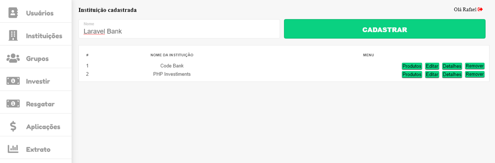

## Sobre o projeto

Sistema para gestão de grupos de investimento, que visam maiores benefícios dos bancos em relação aos investimentos individuais.

##### Login

##### CRUD Usuários

##### CRUD Instituições

##### CRUD Grupos e Relacionar Usuários ao mesmo

##### CRUD Produtos

##### Realizar aplicações

##### Realizar saques

##### Consultar saldo do seus produtos

##### Consultar extrato

## Passo a Passo
* Execute o comando <code>$ composer.install</code>
* Configure o arquivo <code>.env</code>
* Crie DB com o nome indicado no arquivo <code>.env</code>
* Execute o comando <code>$ php artisan migrate --seed</code>

 

###### Ao executar o projeto, caso ocorrra um erro relacionado a "supported ciphers":
* Execute o comando <code>$ php artisan key:generate</code>
* E limpe o cache, com <code>$ php artisan config:clear</code>